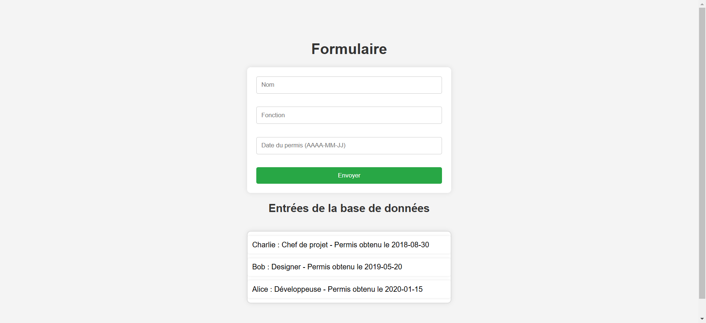

## Stack architecture

This application is made up of 3 Docker containers :

|   Service   |     Software     | Port  |              Description              |
| :---------: | :--------------: | :---: | :-----------------------------------: |
|   Web app   |   Flask 3.1.0    | 12345 |   Python webserver running the app    |
|     DB      |   MariaDB 10.6   | 3306  |               Database                |
| DB frontend | phpMyAdmin 5.2.2 | 12346 | Web interface for database management |

## Deployment

### Prerequisites

Docker Engine up and running. See https://docs.docker.com/engine/install/ if needed.

### How to install
Clone the repo
```bash
git clone https://github.com/colpiche/dev-simulation.git
```

Cd into it :
```bash
cd dev-simulation
```

Deploy the stack
```bash
docker compose up -d
```

### How to use
To access the webapp, open your browser and go to :

```bash
http://ip-of-your-server:12345/
```

## Tests Sikuli

### Conditions de test
 - Ecran 1920x1080
 - Mise à l'échelle Windows 125%
 - Chrome v133.0.6943.142
 - Zoom de la page 100%

### Procédure de test
 - Lancer la stack Docker
 - Lancer Chrome et se rendre sur la page web (http://127.0.0.1:12345/)
 - Lancer le GUI de Sikuli et ouvrir le script voulu
 - S'assurer que la fenêtre de Chrome soit en plein écran et qu'elle ne soit recouverte pas aucune autre (à part Sikuli)
 - Lancer le script

### Test 1 - Formulaire initial

Ce test vérifie le fonctionnement du formulaire initial, avec nom et fonction seulement.
Sikuli va rentrer des chaines de caractères aléatoires dans les champs et vérifier ensuite si les données s'affichent bien en dessous du formulaire une fois qu'il a été soumis.

#### Améliorations possibles

| Problème                      | Description                                                                                                            | Cause                                                                                                                                          | Correction possible                                                                                                                                                                  |
| ----------------------------- | ---------------------------------------------------------------------------------------------------------------------- | ---------------------------------------------------------------------------------------------------------------------------------------------- | ------------------------------------------------------------------------------------------------------------------------------------------------------------------------------------ |
| Faible taux de réussite       | Le test retourne un faible taux de réussite global bien que le site soit fonctionnel.                                  | L'OCR de Sikuli manque de précision et génère un nombre important de faux négatifs : insertion de caractères imaginaires, casse non respectée. | Passer plus de temps à travailler sur la reconnaissance de caractères de Sikuli pour voir s'il est possible d'affiner les paramètres. Sinon ne pas tenir compte de la casse.         |
| Valeurs testées limitées      | Les seules valeurs rentrées dans les champs par Sikuli sont des chaines de 8 lettres, ce qui rend le test peu robuste. |                                                                                                                                                | Modifier la fonction `generate_random_text()` pour qu'elle inclue tous types de caractères (chiffres, symboles...)                                                                   |
| Pas de validation des données | Le site n'effectue pas de validation des données rentrées dans les champs avant de les insérer dans la base.           |                                                                                                                                                | 1. Définir le périmètre des valeurs à accepter (inclusion des alphabets non latins ?)<br><br>2. Mettre en place une validation des données avec une regex et une gestion des erreurs |

### Test 2 - Champ date

Ce test vérifie le fonctionnement du formulaire auquel a été ajouté le champ date, qui est un champ texte libre. Sikuli va rentrer les mêmes chaines de caractères dans les champ `Nom` et `Fonction` et va tester le champ `Date` avec des valeurs correctes et des valeurs erronées.

Si les valeurs sont erronées, le test est réussi si les valeurs ne s'affichent pas dans la zone d'affichage de entrées de la base de données.
Si les valeurs sont correctes, le test est réussi si les valeurs s'affichent dans la zone d'affichage de entrées de la base de données.



#### Améliorations possibles

En plus des améliorations applicables au test précédent, on trouve également :

| Problème         | Description                                                                                                     | Cause | Correction possible                                                                                                                                                                                                                                     |
| ---------------- | --------------------------------------------------------------------------------------------------------------- | ----- | ------------------------------------------------------------------------------------------------------------------------------------------------------------------------------------------------------------------------------------------------------- |
| Champ date libre | Le champ date du formulaire est un champ texte libre qui ne fait qu'indiquer à l'utilisateur le format attendu. |       | Transformer ce champ en type date. La vérification de la date est  effectuée directement par HTML et rajoute ainsi une couche de robustesse à la validation des données.<br>Il conviendrait de modifier le test Sikuli pour l'adapter au nouveau champ. |